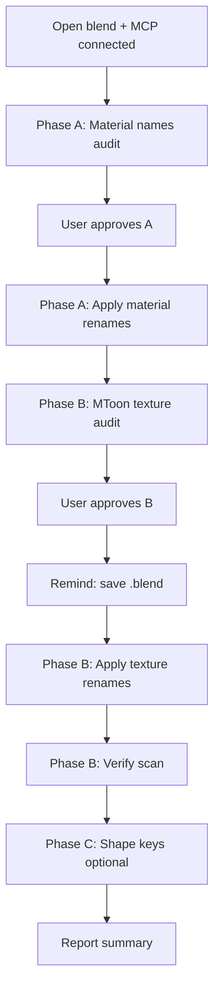

# VRoid VRM Blender cleanup

## When to use

- Cleaning a VRoid-exported `.blend` before rig/animation work or re-export
- Renaming unreadable `N00_*` material names and MToon texture PNGs
- Collapsing `Shader_NoneBlack` / `MatcapWarp` placeholders to semantic globals
- Resetting face shape keys to neutral (optional)

Requires **Blender MCP** (`execute_blender_code`) unless the user runs scripts in the Scripting workspace.

Related skills (separate workflows):

- **blender-bone-remap** — armature / vertex group rename
- **vroid-shapekey-remap** — `Fcl_*` shape key **rename** (not zeroing)

## Before changing anything

1. **Blender open** with target `.blend` loaded.
2. **MCP green** in Cursor Settings → MCP → `blender` (default `http://127.0.0.1:9876` in `mcp.json`).
3. If agent cannot see blender tools: restart MCP entry, reload window, or start a **new chat**.
4. **Ask** which phases to run (A/B/C). Default: A → B; skip C unless user wants neutral face.
5. Every destructive phase: **dry-run → stop for approval → apply → verify**.

Use AskQuestion when scope is unclear (skip Phase A, body spot-check material name, packed vs external textures).

## Progress checklist

```
- [ ] audit-dry-run — Full rename map; print old→new table (global vs per-material)
- [ ] resolve-collisions — Dedupe by filepath; resolve Instance vs .001 pairs; flag collisions
- [ ] user-approve — Pause before any writes
- [ ] apply-renames — Disk PNGs (if external) + datablocks + merge duplicates
- [ ] verify — Re-scan materials; report broken paths and spot-check
```

## Phase order

| Phase | Script | What |
|-------|--------|------|
| **A** | [clean_vroid_material_names.py](scripts/clean_vroid_material_names.py) | Strip VRoid `Nxx_xxx_xx_` prefixes from **material** names |
| **B** | [rename_mtoon_textures.py](scripts/rename_mtoon_textures.py) | Rename **image** datablocks + `//textures/` PNGs for MToon 1.0 |
| **C** | [reset_shape_keys.py](scripts/reset_shape_keys.py) | Zero all shape keys on mesh `Face` (optional) |

**Run A before B** — Phase B `material_slug()` reads material names.



## MCP execution pattern

Set `SKILL_SCRIPTS` to the absolute path of this skill’s `scripts/` folder.

### Phase A — materials

```python
SKILL_SCRIPTS = r"C:\Users\miral\.cursor\skills\vroid-vrm-blender-cleanup\scripts"

exec(open(SKILL_SCRIPTS + r"\clean_vroid_material_names.py").read())
result = run_phase_a(dry_run=True)
```

After user approves:

```python
result = run_phase_a(dry_run=False)
```

### Phase B — MToon textures

**Audit (no writes):**

```python
exec(open(SKILL_SCRIPTS + r"\rename_mtoon_textures.py").read())
result = audit_mtoon_textures()
```

Present `result["table_markdown"]` or `result["rows"]` to the user. **Stop for approval.**

**Apply** — remind user to save `.blend` first:

```python
result = apply_mtoon_texture_renames(result["rename_map"])
```

**Verify:**

```python
result = verify_mtoon_textures()
```

If textures were packed: note **File → External Data → Unpack All Into Files** as optional follow-up.

### Phase C — shape keys (optional)

```python
exec(open(SKILL_SCRIPTS + r"\reset_shape_keys.py").read())
result = run_phase_c(mesh_name="Face", dry_run=True)
```

After approval: `run_phase_c(mesh_name="Face", dry_run=False)`.

## Phase A summary

- Removes `N\d{2}_\d{3}_\d{2}_` and `N\d{2}_\d{3}_[A-Za-z]+_\d{2}_` anywhere in material name (handles `MToon Outline (...)` wrapper).
- Does **not** remove ` (Instance)` from material names.
- Collision-safe unique material names.

## Phase B summary

- **In scope:** image datablock names, `img.filepath`, disk files under `//textures/`, merge `.001` duplicates, rewire `TEX_IMAGE` nodes.
- **Out of scope:** material rename (except A), MToon shader values, VRM export re-test.

Naming:

- Material slug + MToon slot suffix (`body_00_skin_normal`, …).
- Globals: `mtoon_none_black`, `mtoon_none_normal`, `mtoon_matcap_warp`, `mtoon_matcap_warp_face`.
- Lit + shade same image → one `base`.
- Filepath dedupe: outline mats sharing parent PNGs get parent slug.

Full tables: [reference.md](reference.md). Worked examples: [examples.md](examples.md).

## Phase C summary

- Zeros shape key **values** on named mesh (default `Face`).
- For `Fcl_*` **rename**, use **vroid-shapekey-remap** instead.

## MCP troubleshooting

| Symptom | Fix |
|---------|-----|
| `MCP server does not exist: blender` | Settings → MCP → restart `blender`; new chat |
| Green MCP but no tools | Expand blender row — expect ~78 tools including `execute_blender_code` |
| Port mismatch | Match `mcp.json` URL to Blender addon port (e.g. `9876`) |
| Connection refused | Start MCP server in Blender addon panel |

## Out of scope unless asked

- MToon shader parameter edits
- VRM re-export validation
- Bone rename (**blender-bone-remap**)
- `Fcl_*` shape key rename (**vroid-shapekey-remap**)

## Utility scripts

| Script | Entrypoints |
|--------|-------------|
| [clean_vroid_material_names.py](scripts/clean_vroid_material_names.py) | `dry_run_materials()`, `apply_material_renames()`, `run_phase_a()` |
| [rename_mtoon_textures.py](scripts/rename_mtoon_textures.py) | `audit_mtoon_textures()`, `apply_mtoon_texture_renames()`, `verify_mtoon_textures()` |
| [reset_shape_keys.py](scripts/reset_shape_keys.py) | `reset_shape_keys()`, `run_phase_c()` |

Return structured `result` dicts from MCP code for JSON output (assign `result = ...` after exec).
